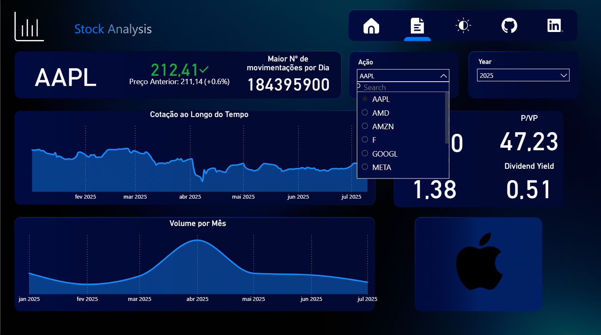
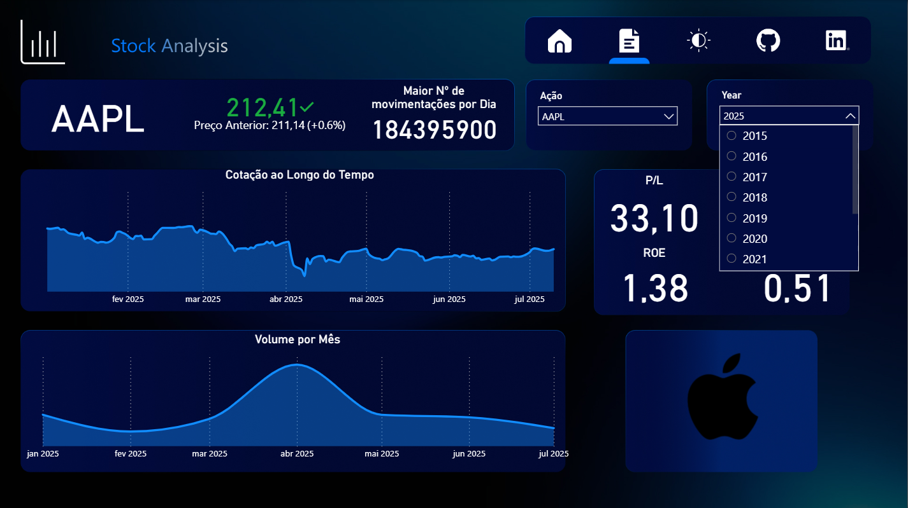

# 📊 Análise de Ações

Projeto pessoal desenvolvido com o objetivo de analisar ações utilizando **Python, PostgreSQL e Power BI**. 

O sistema foi estruturado em três etapas principais:

**1. Pipeline de Dados (Python)**: coleta de informações de ativos financeiros através da biblioteca yfinance e inserção desses dados no banco de dados PostgreSQL.

**2. Armazenamento (PostgreSQL)**: centralização e organização dos dados em um banco relacional.

**3. Visualização (Power BI)**: construção de dashboards interativos a partir da conexão direta (localhost) com o banco, possibilitando análise clara e informativa dos ativos selecionados.

## 🚀 Tecnologias Utilizadas

### Pipeline de Dados

- Python (ETL – extração, transformação e carga)
- yfinance: coleta de dados dos ativos;
- psycopg2: conexão e inserção no PostgreSQL;
- pandas: estruturação e manipulação dos dados.

### Banco de Dados

- PostgreSQL: armazenamento estruturado e seguro das informações coletadas.

### Visualização

- Power BI: construção de dashboards interativos para análise financeira.

### Design

- Figma: prototipagem e definição do visual do dashboard.

## 📷 Exemplos da Aplicação

### 1️⃣ Tela Inicial

### 2️⃣ Filtros por Ativo

### 3️⃣ Filtros por Ano
